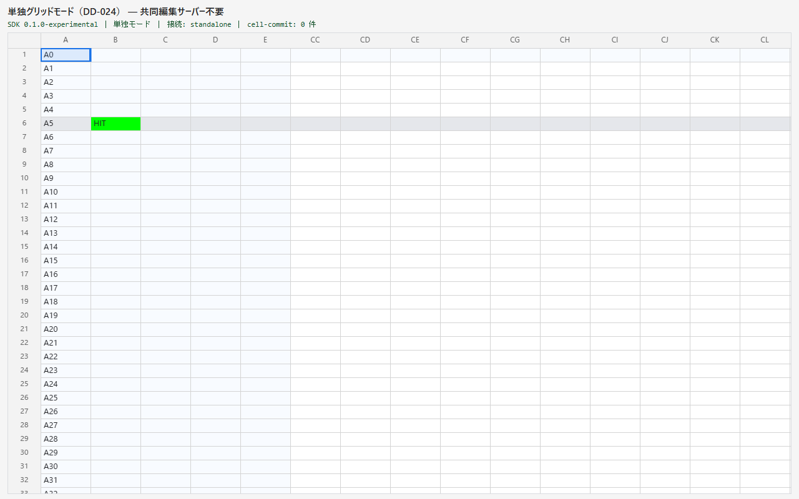

# DD-045 検証記録

## TDD

- RED: `compileRowBackgrounds`、`rowBackground` 描画フック、React prop 写像を先にテスト化し、未実装状態で
  3 files / 8 failed（既存5件はgreen）を確認。
- GREEN: 実装後、同じ対象で 3 files / 13 tests green。

## 実ブラウザー E2E

`apps/playground/e2e/row-backgrounds.spec.ts` で次を実ピクセル検証した。

- 空セルを含む行全体、固定5列 pane と body pane、横スクロール後の遠方列が同じ行色になる。
- 列背景との交差は行背景が勝ち、値ベース書式は行背景より勝つ。
- 行挿入・削除で index が変わっても、RowId `r5` の背景が同じ行実体へ追従する。
- 未知 RowId は `row-background-unknown` warn 1回のみで mount 成功し、後から同じ RowId が現れれば塗られる。
- 横スクロール・表示設定だけでは committed hash が変わらず、`cell-commit` は0件。

結果: 3 tests green。全 E2E 回帰は 161 tests green。

## 性能（AC8）

再現コマンド:

```text
npx playwright test --config apps/playground/playwright.config.ts apps/playground/e2e/zz-row-backgrounds-perf.spec.ts --headed
```

環境: Chromium headed、viewport 1280×800、205列×60行、固定5列、静的行背景2本、横スクロール1.5秒。

| 指標 | 背景なし | 行背景2本 | 差 | 予算 |
|---|---:|---:|---:|---:|
| frame p50 | 16.7ms | 16.7ms | 0.0ms | 参考 |
| frame p95 | 16.8ms | 16.8ms | 実質0.0ms | < 33ms、背景なし +3ms以内 |
| worst | 17.5ms | 17.1ms | -0.4ms | 参考 |

判定: PASS。行背景2本による観測可能なフレーム回帰なし。

## Manual Gate M1



- 横スクロール後も、固定5列とスクロール側（CC列以降）の境界をまたいで灰色帯が連続している。
- 空セルを含む帯に欠け・1行ずれなし。
- 値ベース書式の緑セルは灰色帯より上に描かれ、罫線も消えていない。

判定: PASS。

## 回帰ゲート

- `npm run typecheck`: green（全 workspace）
- `npm run lint`: green（boundary new=0）
- `npm run test`: 120 files / 1241 tests green
- `npm run test:e2e`: 161 tests green
- `npm run test:e2e:showcase`: 3 tests green
- `npm run build`: green（playground / pocd-browser-bench / showcase）
- `tests/contract/facade-surface.test.ts`: 9 tests green、公開 `.d.ts` snapshot 更新
