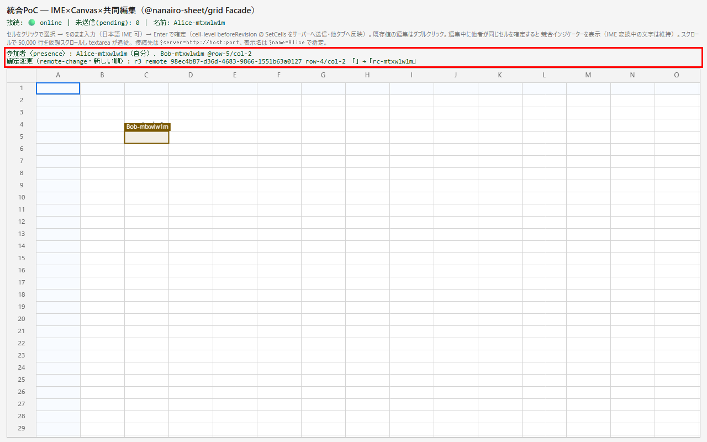
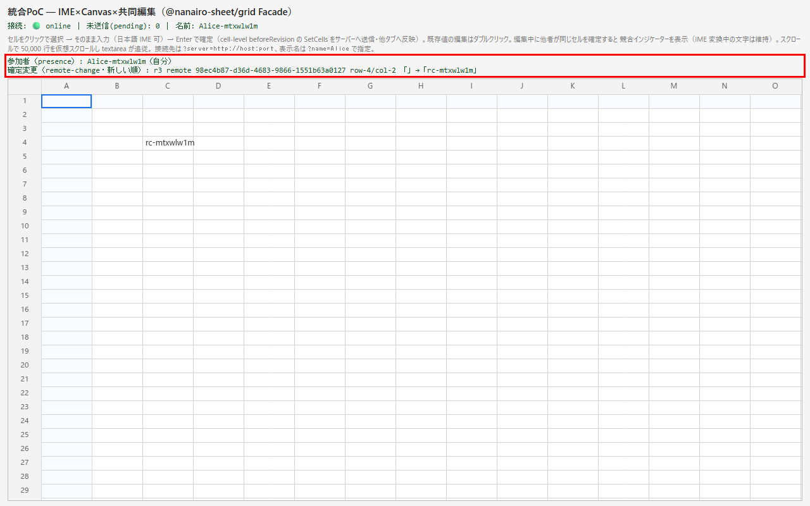

# DD-049: 共同編集の受理通知・他者変更イベント・Presence 公開（consumer 駆動: 広島空港 予算共同編集）

| 作成日 | 更新日 | ステータス | 補足 |
|--------|--------|-----------|------|
| 2026-09-12 | 2026-09-12 | 確認待ち | 実装・Codex 2 回（指摘 5 件反映）・全回帰 green。コミットと alpha 配布（広島 DD-005-3 引き渡し）の判断待ち |

> アプローチ: 標準＋TDD（純関数: イベント写像・presence 差分）＋E2E駆動（配線: playground 2 クライアント）。要件は consumer の設計DDで確定済み（guides.md §1）
> リスク: なし（認可・DBスキーマ・外部I/F・機密情報に触れない。`authenticate` は既存のまま）

```text
Risk Class: A（公開 API 新設〔serve オプション 1 点・GridEvent 種別 2 点・React callback 2 点・handle 1 点〕。sequencer/protocol/永続化は無改変＝Phase 1 実読で確定）
Risk Triggers: 公開 API/Options/Event の新設／H4 が collab session→grid のイベント写像に接する（rollback-replay 本体は無改変＝通知の追加のみ）
Human Spec Gate: required → 論点 1〜6 を推奨案で代行確定（2026-09-12・ユーザー指示「DD-049 を進める／実装後に Codex CLI レビュー・指摘は妥当性判断のうえ修正」による。契約は DD-049/contract.md）
Codex: high（実装完了後にユーザー指示で CLI 実行）
Manual Gate: あり・クローズ非ブロック（M1=2 ブラウザで他者変更イベントと参加者一覧の実機確認。未実施なら「既知の未保証境界」へ移送）
External Review: なし
Evidence Level: full（A 区分）
```

## 目的

consumer 統合②（広島空港 予算管理モック・共同編集 W-04 = 広島リポ DD-005）が、**DB も業務正本も持たない構成**
（静的SPA＋`serve()` をメモリだけで動かす）で共同編集を成立させるために欠けている SDK 側の口を提供する:

- **H2 受理通知フック**: `serve()` が受理・配信した操作を consumer へ通知する（ストアを持たない consumer が集計の再計算を起動できる）
- **H4 他者変更イベント**: 共同編集モードで、他クライアント起因の受理済み変更（actor・セル・前後値）を grid の公開イベントとして届ける
- **H5 参加者一覧**: 現在の Presence（表示名・activeCell）を Facade / React から読める・変化を購読できる
- **H8 紹介サイト**: `features.json` の `presence` が `planned` のまま（実装済み）＝表記の是正

## 背景・課題

- 要件の正本は**広島リポ `doc/DD/DD-005/sdk-requirements.md`**（H1〜H8・優先・つなぎ）。乖離したらメモ側が勝つ（DD-035 と同運用）
- 松下（DD-026 U1〜U3）は Postgres ストアを持つため、受理の観測を `oplog.append` で代替できた。広島は保存先を持たないので、
  **通知のためだけに偽の oplog/snapshotStore を渡す**ことになる（メモ H2「つなぎ」）。これは SDK の責務境界の歪みであり、素直な口が要る
- 現状の実測（2026-09-12・alpha.5 / `packages/*/src`）:

| # | 要件 | 現状 | 欲しい形（メモの要旨） |
|---|------|------|----------------------|
| H2 | 受理通知 | `serve()` は `onDiagnostic` のみ。受理は durable 解決後に ACK/broadcast を dispatch（`server.ts` L300）するが consumer への口が無い（松下メモ U5「任意」で未実装） | `serve({ onAccepted })`。受理後（durable・配信後）に documentId / revision / actorId / 変更（rowId・columnId・value・previousValue）を渡す。`submit()` 起点も区別付きで通知 |
| H4 | 他者変更イベント | `GridEvent` は connection/pending/rejected/divergence/error/layout/cell-commit（**単独専用**）/row-structure-change/link-open。他者の受理済み変更は committed へ適用されるだけで利用側に届かない | 共同編集モードで `{ type: 'remote-change', revision, actorId, changes }` を発火。React は `onRemoteChange`。自分の ACK 済み操作を含めるかは論点 2 |
| H5 | 参加者一覧 | `collab` の `session.knownPresences()` → `grid-backend.knownPresences()` → mount-controller が描画に使う。Facade（`GridInstance`）・React handle には未公開 | `GridEvent { type: 'presence', users }`（変化時）＋ handle `presences()`（現在値）。users は userId / displayName / activeCell（rowId・columnId）/ 自分フラグ |
| H8 | features.json | `presence` = `planned`（DD-019 stage2-backlog）。実装は DD-041 の修正記録どおり枠・名前タグまで描画済み | `available` へ。source に実装 DD を明記し、features smoke を通す |

- **対象外**（回収先を明記）: **H1 数式・集計** → DD-022（Stage 2 縦切り・`packages/formula` は成立済み・Facade 非搭載）。
  consumer は H2 を使ったサーバー再計算＋`submit` で当面しのぐ（H2 が本DDの最優先である理由）。
  **H6 セルコメント** → セル単位書式モデル（stage2-backlog §3.5）と統合。**H7 行の編集権限（サーバー側検査）** → 松下 R4 と同じ「将来スコープ」＝
  stage2-backlog へ consumer 要望として追記（Phase 5）。**H3 変更者の可視化** → 論点 3

## 検討内容（Human Spec Gate）

| # | 論点 | 選択肢 | 推奨と理由 |
|---|------|--------|-----------|
| 1 | H2 の呼び出し位置と失敗時 | (a) durable 解決＋broadcast dispatch の**後**に fire-and-forget（例外は握りつぶし＋診断 warn）/ (b) durable 解決の前に await（consumer が拒否できる） | **(a)**。受理判定は sequencer の責務（OCC）で、consumer に拒否権を渡すと protocol へ波及（A 昇格要因）。`onDiagnostic` と同じ「副次機能は本体へ波及させない」方針。consumer の再計算は `submit()` で別 revision として入る |
| 2 | H4 の対象 | (a) 他クライアント起因のみ / (b) 自分の ACK 済みも含め `origin: 'local' \| 'remote' \| 'server'` で区別 | **(b)**。consumer の「変更履歴」は自分の分も同じ経路で作れる（単独モードの `cell-commit` と役割が揃う）。rollback-replay で巻き戻された楽観適用は通知しない（committed に入った時点のみ） |
| 3 | H3 変更者の可視化を本DDに含めるか | (a) 含める: `setCellMarks(map)`（view-local・runtime 差し替え可・rowId×columnId→色）を handle に足す / (b) 含めない: H4 で actor が取れるので描画は consumer の別レイヤ / (c) 子DD DD-049-1 へ分離 | **(c)**。H3 はセル単位の書式モデル（stage2-backlog §3.5・rowBackgrounds/columnBackgrounds は行列単位まで）に接し、Presence 描画との重なり順も決める必要がある。本DDのイベント系と混ぜると 1 DD で状態所有者が増える（昇格ルール）。**DD-049-1 として起票し、本DD完了後に着手** |
| 4 | H5 の公開面 | (a) イベントのみ / (b) イベント＋handle `presences()` / (c) React props で users を state 化 | **(b)**。React Facade は「文書データを React state へ複製しない」原則（DD-025）。参加者は文書ではないが同じ薄い写像で `onPresenceChange` callback＋handle 直結にする。TTL 失効・切断の除外はセッション側の既存挙動に従う |
| 5 | H1 数式との関係 | (a) 本DDで簡易 SUM 行/列オプションを足す / (b) DD-022 待ち。consumer は H2 でしのぐ | **(b)**。簡易版を Facade に載せると DD-022 の設計（固定ID参照・依存グラフ・replay 決定性）と二重になる。H2 が入れば consumer のつなぎは SDK 改造なしで成立する |
| 6 | 子DD分割 | 単一 / 分割 | **単一（H2/H4/H5/H8）＋H3 は DD-049-1**。レビューゲートは完了後の Codex 1 回（DD-035 前例） |

## 決定事項

論点 1〜6 は**推奨案で代行確定**した（2026-09-12）。公開面の契約（型・発火条件・診断コード・React 写像・テストシナリオ）の正本は **`DD-049/contract.md`**。

| # | 確定 | 要点 |
|---|------|------|
| 1 | (a) durable 解決＋配信の後に fire-and-forget | 受理判定は sequencer の責務のまま。hook の throw・reject は診断 `on-accepted-error`（warn）に閉じる |
| 2 | (b) 自分の ACK 済みも `origin: 'local' \| 'remote' \| 'server'` で通知 | committed に入った時点だけ。rollback された楽観適用は通知しない |
| 3 | (c) H3 は子DD DD-049-1 | Phase 5 で起票済み（`doc/DD/DD-049-1_変更者の可視化.md`） |
| 4 | (b) `presence` イベント＋`GridInstance.presences()` | React は `onPresenceChange` callback＋handle `presences()` |
| 5 | (b) H1 は DD-022 待ち | consumer は H2＋`submit` でつなぐ（quick-start §3d に例） |
| 6 | 単一DD（H2/H4/H5/H8）＋DD-049-1 | Codex は完了後 1 回 |

### Phase 1 実読で確定したこと（📐 実装前詳細化）

- **sequencer / protocol / 永続化は無改変で成立する。** H2 は server-hono の `RoomBridge` だけで閉じる（受理経路は `route()` と
  `submitFromServer()` の 2 つで、受理だけが Room から target=all の operations を返す。PersistentRoom は `append` 解決後に Outbound を返す
  ＝dispatch の直後に呼べば「durable・配信後」）。前値は Sequencer の copy-on-write 文書の参照を Room 投入直前に捕捉して求める。
- **H4 の通知点は `ClientSession.reconcileServerOperation`**（サーバー op を committed へ適用する唯一の地点）。`applyOperation` の
  ChangeSet（before/after）をそのまま使う。snapshot bootstrap は committed を丸ごと差し替え op 単位の差分が無いため通知しない（境界）。
- 計画からの変更（実装判断・契約の範囲内）:
  - H4 の通知は `SessionEvent` へ足さず、**専用の opt-in callback `onCommittedOperation`** にした。`SessionEvent` へ足すと grid の
    `toGridEvent` 網羅と debug `lastEventType` の意味が変わり、既存 observer へ波及するため（AC7 の無修正 green を守る）。
  - `remote-change` のイベント形は `row-structure-change` と同じく**入れ子**（`{ type: 'remote-change', change: GridRemoteChange }`）。
    React の `onRemoteChange(change)` へそのまま渡せる。
  - `remote-change`・他者由来の `presence` は 1 サーバーメッセージの処理（適用・rollback/replay・Render State の dirty 立て）が終わってから
    配る（SessionSync に `onServerMessageSettled` を追加）。自分のアクティブセル移動による `presence` はマイクロタスクへ遅らせる
    （セルフレビューで追加・ログ参照）。listener から命令 API を呼んでも整合した状態を読むため。
  - 行の挿入・削除は `remote-change` の対象外（セル値のみ）。`onAccepted` は全 op 種別を通知する（行操作は `changes` が空）。

## 受け入れ基準

| # | 基準（操作 → 期待結果） | 検証方法 |
|---|------------------------|---------|
| 1 | `serve({ onAccepted })` を渡し、クライアントがセルを確定 → durable・配信後に 1 受理 = 1 回、documentId / revision / actorId / changes（前後値）を受け取る。`submit()` 起点は `origin: 'server'` で届く。フックの throw は診断 warn になり serve は止まらない | Phase 2 unit `serve-on-accepted.test.ts`＋E2E |
| 2 | 複数文書 serve でも文書ごとに正しい documentId で届く。reject（OCC）は届かない | Phase 2 unit |
| 3 | 共同編集モードで B が確定 → A の `onEvent` に `remote-change`（origin 'remote'・actorId・changes）が届き、値は committed と一致。A 自身の確定は ACK 後に origin 'local' で届く。rollback された楽観適用は届かない | Phase 3 unit（collab `committed-operation.test.ts`・grid `remote-change.test.ts`）＋playground E2E 2 クライアント |
| 4 | 単独グリッドモードでは `remote-change` は発火せず `cell-commit` は従来どおり | Phase 3 unit（写像）＋E2E（単独ページで非発火） |
| 5 | B が接続・セル移動・切断 → A の `presence` イベントが順に届き、handle `presences()` の現在値と一致する。自分は `self: true` | Phase 4 unit（`presence-list.test.ts`）＋E2E |
| 6 | React: `onRemoteChange` / `onPresenceChange` が callback 系（差し替えで remount しない）として写像され、handle に `presences()` がある | Phase 4 unit `nanairo-sheet-view.dd049.test.ts` |
| 7 | 新オプション・イベント未使用の既存 consumer は現行挙動と完全一致（既存 unit・invariants・E2E 全スイートが無修正 green） | Phase 5 全回帰 |
| 8 | 公開 .d.ts snapshot の差分が追加のみ・CHANGELOG 記載・`features.json`（presence を available・新イベントを collab/react の summary へ）更新・boundary lint new=0 | Phase 5 contract test＋features smoke＋lint |
| 9 | stage2-backlog に H6/H7 が consumer 要望として追記され、DD-049-1（H3）が起票されている | Phase 5 目視＋`dd-index-gen` |

## タスク一覧

### Phase 1: 仕様確認（Human Spec Gate）
- [x] 論点 1〜6 を確定し `DD-049/contract.md` に契約を固定（型・イベント・診断コード・React 写像）— 推奨案で代行確定（2026-09-12）
- [x] 📐 実装前詳細化: `packages/server-hono/src/server.ts`（durable→ACK/broadcast 経路）・`packages/collab/src/session.ts`（committed 適用と presence 保持）・`packages/grid/src/mount-controller.ts`（SessionEvent→GridEvent 写像）・`packages/react/src/index.ts` を実読し、sequencer/protocol/永続化が無改変で成立するか確定（改変が要るなら停止して報告）→ 無改変で成立（決定事項「Phase 1 実読で確定したこと」）
- [x] 🔬 機械検証: `bash scripts/dd-health.sh --dd DD-049 --new` → ⚠️なし（info 2 件のみ）／`bash scripts/doc-check.sh` → OK

### Phase 2: H2 受理通知フック（server-hono）
- [x] `packages/server-hono/src/index.ts` / `serve-types.ts`: `ServeOptions.onAccepted?: ServeAcceptedHook` と型 `ServeAcceptedEvent` / `ServeAcceptedCellChange` / `ServeAcceptedOrigin`（JSDoc=contract）
- [x] `packages/server-hono/src/server.ts`: durable 解決・broadcast dispatch 後に呼ぶ。例外は診断 `on-accepted-error` warn で握りつぶす。`submit()` 起点は `origin: 'server'`
- [x] 🔬 機械検証: `npx vitest run packages/server-hono packages/collab` → 23 files / 140 tests green（新規 `serve-on-accepted.test.ts` 11 件）・typecheck green

### Phase 3: H4 他者変更イベント（collab → grid）
- [x] `packages/collab/src/session.ts`: committed へ適用した受理済み操作（remote / 自分の ACK）を opt-in callback `onCommittedOperation` で通知（既存の rollback-replay 本体は無改変）
- [x] `packages/grid/src/remote-change.ts`（純関数の写像）・`session-sync.ts`（`onServerMessageSettled`）・`index.ts` / `mount-controller.ts`: `GridEvent` に `remote-change` を追加し写像。単独モードでは発火しない
- [x] `apps/playground/e2e/remote-change.spec.ts`（新規・2 クライアント＋単独ページ）
- [x] 🔬 機械検証: `npx vitest run`（collab `committed-operation.test.ts` 6 件・grid `remote-change.test.ts` 4 件・`session-sync.test.ts` 10 件）→ green／`npx playwright test remote-change` → 2 passed

### Phase 4: H5 参加者一覧（grid / react）
- [x] `packages/grid/src/presence-list.ts`（純関数）・`index.ts` / `mount-controller.ts`: `GridEvent { type: 'presence', users }`＋`GridInstance.presences()`（`knownPresences` を公開型へ写像・内部型を出さない=R7）
- [x] `packages/react/src/index.ts`: `onRemoteChange` / `onPresenceChange` callback＋handle `presences()`／`nanairo-sheet-view.dd049.test.ts`
- [x] 🔬 機械検証: `npx vitest run packages/grid/src/presence-list.test.ts packages/react` → green（presence-list 5 件・react 4 files / 32 tests）

### Phase 5: 統合・提供開始
- [x] `tests/contract` snapshot 更新（差分は追加のみを目視＝削除 4 行は import/export 列挙と診断コード JSDoc の拡張）／`CHANGELOG.md` Added／`doc/archived/DD/DD-017/error-codes.md`（`on-accepted-error` 追加）
- [x] `apps/showcase/src/features.json`: `presence` → `available`（source に実装 DD）、`collab` / `react` / `integration-adapters` の summary に新イベント・フックを追記 → features smoke green
- [x] `doc/plan/stage2-backlog.md`: §3.7「consumer 要望（広島空港）」として H1/H3/H6/H7 の回収先を追記／DD-049-1（H3 変更者の可視化）を起票・`dd-index-gen`
- [x] `doc/quick-start.md`: §3d（`onAccepted` で再計算）・§4（`remote-change` / `presence`）・§4c（React callback・`presences()`）を追記（製品化 6 観点-5 DX 成果物）
- [x] 📸 エビデンス: 2 クライアント E2E のスクショを `DD-049/` へ（下記「エビデンス」）
- [x] 🔬 機械検証（全回帰 1 回）: `npm test`／`npm run typecheck`／`npm run lint`（boundary new=0）／`npm run test:e2e`／`npm run test:e2e:showcase` → 全 green（unit 128 files / 1,311 tests・typecheck・lint boundary new=0・playground E2E 203 passed〔既存 201＋新規 2〕・showcase E2E 4 passed）。Codex 指摘の修正後に 2 回目も green（unit 1,313 tests・playground E2E 203・showcase E2E 4）、Codex 第 2 回の修正後に 3 回目も green（unit 1,315 tests・typecheck・lint boundary new=0・playground E2E 203・showcase E2E 4）
- [ ] tarball 再生成（`scripts/release/build-release.sh`）は広島側 DD-005-3 が受け取る。引き渡し手順は広島メモ「持ち込み後の作業」→ DD-048 と同じく **source commit 後**に生成する（gitDirty=false の成果物を渡す）

### 完了前チェック
- [x] 受け入れ基準 1〜9 を照合（未達成があれば理由をログへ）→ 9 件とも充足（照合結果はログ）
- [x] 😈 セルフレビュー 1 巡（重点: onAccepted の再入〔フック内 submit〕・presence TTL 失効時のイベント順序・remote-change と rollback の境界）→ 所見はログ
- [x] Manual Gate 未実施分を「既知の未保証境界」へ移送（M1）

## エビデンス

| 画面 | 説明 |
|------|------|
|  | ✅ `?activity=1` の A（赤枠）: 参加者一覧に自分と B（アクティブセル付き）、確定変更に B の確定（`remote`・B の userId・前値→値） |
|  | ✅ B のタブを閉じた後の A: 参加者一覧から B が消える |

## 既知の未保証境界・既知制約

- **Manual Gate M1 未実施（実機 2 ブラウザでの目視）**: B の確定が A の `remote-change` に届き、参加者一覧に B が出て B を閉じると消えることは、
  Playwright の Chromium 2 コンテキスト（別ユーザー）で自動検証済み（`remote-change.spec.ts`・証跡 2 枚）だが、人手の実機 2 ブラウザでは目視していない
  （手順は下記 M1）。実機で表示・通知に問題が出たら別DDを起票する。
- **remote-change は snapshot bootstrap で確立した状態を通知しない**: 初回接続（fresh join）と、切断中に 1,000 revision を超えて進んだ文書への
  再接続では、その区間の変更が `remote-change` として届かない（consumer の「変更履歴」はその区間が欠ける。サーバー側の `onAccepted` は全受理を通知する）。
- **remote-change は行の挿入・削除を含まない**（セル値の SetCells のみ）。
- **presence**: 自分が切断中は最後に知っていた一覧を保持する（グリッド上の他者の枠と同じ扱い）。サーバーが旧接続の切断を検知するまで
  （無通信なら TTL 15 秒）、再接続した同じ利用者が一時的に二重に載りうる。
- **presence の自分の userId は grid の clientId**: `authenticate` でサーバーが actorId を上書きする構成では、他者から見た userId・自分の
  `remote-change`（local）の actorId と一致しない。自分の判定は `self` を使う。
- **onAccepted**: hook の戻り Promise は待たないため、遅い hook は後続の受理の通知と並走する（逐次処理が要る consumer は hook 内で自前のキューを持つ）。
  `stop()` 実行中に durable 化を終えた受理は通知されうる。無限ループ防止は consumer 責務。順序保証は文書内のみ。
- **hook を入れ子にしない保証は 1 つの `serve()` の中だけ**: 同じプロセスで別の `serve()` インスタンスを立て、hook からそちらの `submit` を呼ぶと、
  そのインスタンスの hook は同期で呼ばれうる（1 プロセスに複数 serve を立てる構成は想定外。複数文書は `documents` で 1 つの serve にまとめる）。
- **配布**: 本DDの変更は `0.1.0-alpha.5` の tarball に含まれない（CHANGELOG は [Unreleased]）。広島側 DD-005-3 への引き渡しは source commit 後に
  `scripts/release/build-release.sh` で次の alpha を生成して行う。

## Manual Gate（クローズ非ブロック・正味）

| # | 項目 | 正味 |
|---|------|------|
| M1 | 2 ブラウザで B の確定が A の `remote-change` に届き、参加者一覧に B の表示名が出て、B を閉じると消える | 3 分 |

手順（M1）: `bash scripts/dev-start.sh` → ブラウザ A で `http://localhost:5885/poc-integration.html?name=A&activity=1&server=http://127.0.0.1:9499`、
別ブラウザ（または別プロファイル）で同じ URL を `name=B` で開く → B でセルを選んで値を確定 → A のヘッダ下「確定変更（remote-change）」に
`remote`・B の userId・前値→値、「参加者（presence）」に B とアクティブセルが出る → B のタブを閉じると A の参加者から B が消える。

## ログ

### 2026-09-12
- 起票。広島空港モック（`C:/repo/hiroshima-airport` DD-005 共同編集の本物化）からの持ち込みで、広島側セッションが起票を代行（以後は spreadjs 側のセッションで進める）。要件出所: 広島 `doc/DD/DD-005/sdk-requirements.md` H1〜H8（2026-09-12 版）
- スコープ判断（推奨・Gate 待ち）: H2/H4/H5/H8 を本DD、H3 は DD-049-1、H1 は DD-022、H6/H7 は stage2-backlog へ
- 番号は DD-048 の次＝DD-049（`doc/plan` に予約番号なし）
- spreadjs 側セッションで着手。ユーザー指示「DD-049 を進める・実装が一通り終わったら Codex CLI でレビュー・指摘は妥当性判断のうえ Claude で修正」を受け、Human Spec Gate（論点 1〜6）を**推奨案で代行確定**した（実装→レビューまで通す指示のため停止しない。代行の事実はヘッダ Human Spec Gate 行にも記載）
- Phase 1: server-hono `server.ts`（RoomBridge・PersistentRoom の durable 経路）・server `room.ts` / `sequencer.ts` / `persistent-room.ts`・collab `session.ts`・grid `mount-controller.ts` / `session-sync.ts` / `presence-adapter.ts` / `standalone-session.ts`・react `index.ts`・core `apply.ts` を実読。sequencer/protocol/永続化は無改変で成立すると確定し、契約を `DD-049/contract.md` に固定（計画からの実装判断は決定事項に記載）
- Phase 2: `RoomBridge` の dispatch 直後に `notifyAccepted`（受理判定＝target=all の operations・前値は Room 投入直前に捕捉した copy-on-write 文書から逐次算出・envelope は structuredClone・hook の同期 throw／async reject は `on-accepted-error`、onDiagnostic 未指定は console.error）。`serve-on-accepted.test.ts` S1〜S8（durable 前は未通知・保留中の連続 op の前値・submit は hook 後に解決・複数文書・OCC reject/noop/duplicate 非通知・hook 内 submit の再入・tail catch-up で複製を確認）
- Phase 3〜4: collab `onCommittedOperation`（rebuild 後に ChangeSet 付きで通知）・grid `remote-change.ts` / `presence-list.ts`（純関数）・SessionSync `onServerMessageSettled`・mount-controller（キュー→settle で配信・参加者一覧の変化判定・`presences()`）・React 写像。playground に `?activity=1` のときだけ参加者・確定変更を出す表示を追加（Manual Gate M1・証跡用。既定では DOM を作らない＝既存 E2E 不変）
- 😈 セルフレビュー所見（反映済み）: 自分の presence 通知は IME 状態機械の `handleEvent` 末尾と `noteServerUpdate`（サーバーメッセージ処理の途中）から呼ばれるため、同期で listener を呼ぶと listener からの命令 API（setActiveCell 等）が editor の処理途中と競合しうる（DD-038 の cell-commit 再入と同じ懸念）→ マイクロタスクへ遅らせ同一タスク内の連続移動を 1 回にまとめた。`remote-change` は同じメッセージで同期発火する `rejected`・`pending` より後に届く点を contract §3 に明記。onAccepted の再入（hook 内 submit）は submitFromServer の同期区間で採番・投入が完結し、配信と通知は後続のマイクロタスクで revision 順に行われる（S7 で確認）
- Phase 5: contract snapshot（追加のみ）・CHANGELOG [Unreleased]・features.json・DD-017 error-codes・stage2-backlog §3.7・DD-049-1 起票・quick-start 追記・証跡 2 枚。全回帰 1 回目: unit 128 files / 1,311 tests・typecheck・lint（boundary new=0）・playground E2E 203 passed・showcase E2E 4 passed → green
- Codex レビュー（high・`--uncommitted`・[依頼](DD-049/codex-review-request.md)／[結果](DD-049/codex-review-result.md)）: 総評「要修正」・findings 2 件（Codex は sandbox の制約で Vitest を実行できず、独自スクリプトで再現）。到達性×実害で仕分けし、**2 件とも採用**:
  - **P1 通知・配信の revision 順違反**: 永続化なしで、同じ data チャンクで届いた連続フレームの 1 件目の hook から `submit` すると通知が 2(client)→4(client)→3(server)。`submitFromServer` が同期 Room の結果にも `await` しており、続くクライアント op が先に配信・通知されていた。再接続時の一括再送や速い入力で到達し、consumer のミラー・差分集計が順不同になる（contract §2 の順序保証に違反）。→ RoomBridge に submitOperation の**投入順 FIFO**（`deliverSubmitInOrder` / `drainSubmitDeliveries`）を入れ、`route` と `submitFromServer` の配信・受理通知を統一。hook 内の submit は実行中のループが続けて配るため hook は入れ子にならない（contract §2・§6 を更新）。回帰テスト S9（cork で 2 フレームを 1 write にまとめる）を**先に追加して修正前の red（2→4→3）を確認**。副次的に、永続化なしの `server.submit` の配信が後続クライアント op より遅れる既存の順序入れ替わり（クライアントは revision バッファで収束していた）も解消（CHANGELOG Fixed）
  - **P2 失敗診断の文字列化が throw**: hook が null prototype の値を throw/reject すると `String()` が TypeError → 受理済み `submit` が reject／async reject の監視から未処理 rejection（Node 既定でプロセス終了）。→ `errorMessage` を throw しない実装にし、`describeThrown` を追加、`reportAcceptedFailure` を例外隔離。回帰テスト S10 を**先に追加して修正前の red（TypeError）を確認**
  - 修正後: server-hono＋collab 23 files / 142 tests（S9/S10 green・durable ACK・reconnect-fault・収束・永続化の既存スイート無修正 green）・typecheck・lint green。contract snapshot は onAccepted JSDoc 1 行の更新のみ。全回帰 2 回目（修正後）: unit 128 files / 1,313 tests・typecheck・lint（boundary new=0）・playground E2E 203 passed・showcase E2E 4 passed → green。修正の確認として Codex 第 2 回（high・修正差分に絞った [依頼](DD-049/codex-review-request-2.md)／[結果](DD-049/codex-review-result-2.md)）を実行
- Codex 第 2 回: 総評「要修正」・findings 3 件（第 1 回の 2 件の再現条件は解消を確認）。**3 件とも採用**（いずれも第 1 回の修正が持ち込んだ問題）:
  - **P1 reject 応答が先行 append 待ちで止まる**: 第 1 回の FIFO が、revision を消費しない応答（OCC reject・noop・duplicate ACK）まで先行 op の durable 化待ちにしていた。onAccepted 未指定の既存 consumer にも及ぶ従来挙動からの退行（AC7）で、ストアが settle しなければ応答が返らない。→ 先行の未 settle 件を越えないのは受理を含む件だけにし、reject 等と失敗は settle しだい配る（`takeDeliverableSubmit`・`consumesRevision`）。回帰テスト S11（append 保留中にサーバー起点・クライアント op の reject が返る・onAccepted 未指定）を**先に追加して修正前の red（timeout）を確認**
  - **P2 別文書への submit で hook が入れ子になる**: 配信中フラグが RoomBridge（文書）単位だったため、文書 A の hook から文書 B へ submit すると B の配信が即座に回り hook が入れ子になっていた（contract §2 違反）。→ 配信ループを serve 全体で 1 本に（`SubmitDeliveryLoop`・各 RoomBridge は「配れる 1 件を配る」手順を登録）。回帰テスト S12 を**先に追加して修正前の red（start:A→start:B→end:B→end:A）を確認**
  - **P3 S9 の前提（同じ data チャンク）を検証していない**: TCP の受信側でまとまらないと修正前でも green になり得た。→ 1 件目の hook で積んだマイクロタスクが 2 件目の hook 時点で未実行であること（ws サーバーは 1 チャンク内の複数メッセージを同期に emit する＝ws 8.21 の `allowSynchronousEvents` 既定 true）で前提の成立を確かめ、成立するまで最大 5 回やり直す
  - 修正後: server-hono＋collab 23 files / 144 tests（S9/S11/S12 を含む）・typecheck・lint green。**Codex レビューはここで打ち切る**（第 2 回の指摘は第 1 回の修正に起因する範囲に収束し、すべて回帰テスト付きで解消した。狭いエッジへ回数を重ねない）。全回帰 3 回目（第 2 回の修正後）: unit 128 files / 1,315 tests・typecheck・lint（boundary new=0）・playground E2E 203 passed・showcase E2E 4 passed → green
- 受け入れ基準の照合（9 件とも充足）:
  - AC1: `serve-on-accepted.test.ts` S1（durable 前は未通知・ACK 後に 1 回・前後値・oplog と同形の envelope・authenticate の actorId）/ S3（origin server・hook 後に submit 解決）/ S4・S10（throw・reject・文字列化できない値でも診断に閉じ serve は継続）。E2E 欄は、playground のサーバーが onAccepted を使わないため、実 WS サーバー＋実クライアントの unit で代替
  - AC2: S5（文書ごとの documentId・OCC reject 非通知）・S12（別文書への submit）
  - AC3: collab `committed-operation.test.ts` C1〜C3（rollback/reject は非通知・bootstrap 非通知・順不同/重複/再接続）・grid `remote-change.test.ts`・E2E E1（B の確定が A に remote・B 自身に local・値は committed と一致）
  - AC4: E2E E2（単独ページで cell-commit は出て remote-change/presence は出ない・`presences()` は空）＋写像 unit
  - AC5: `presence-list.test.ts`・E2E E3（参加・移動・切断が順に反映・最後の presence イベント＝`presences()`・自分は self）
  - AC6: `nanairo-sheet-view.dd049.test.ts` R1〜R3
  - AC7: 全回帰 3 回とも既存の unit・invariants・E2E が無修正 green（既存テストファイルの変更 0 件）
  - AC8: 公開 .d.ts snapshot は追加のみ・CHANGELOG（Added／Fixed）・features.json（presence→available・collab/react/integration-adapters）・features smoke・boundary lint new=0
  - AC9: stage2-backlog §3.7（H1/H3/H6/H7 の回収先）・DD-049-1 起票・dd-index-gen
- ステータスを「確認待ち」にした（Manual Gate 待ちではない＝M1 は境界へ移送済み）。残りはユーザー判断: (1) 本DDの変更のコミット → ユーザー指示「作業が終わったらそろそろコミットしてほしい」により 2026-09-12 にコミット (2) alpha の版採番と `scripts/release/build-release.sh` による tarball 生成・独立 consumer 検証（DD-048 と同じく source commit 後＝gitDirty=false） (3) 広島 DD-005-3 への引き渡し記録 → 完了・アーカイブ
- 密度計測: 人間確認 0 分（Human Spec Gate は推奨案で代行）／Codex high × 2 回（findings 2＋3＝5 件・全採用・すべて回帰テストを先に追加して red を確認）／Manual Gate 実施 0 件（M1 は境界へ移送）／全回帰 3 回（unit 約 1 分・E2E 約 4 分）／着手から実装・レビュー反映まで同日
