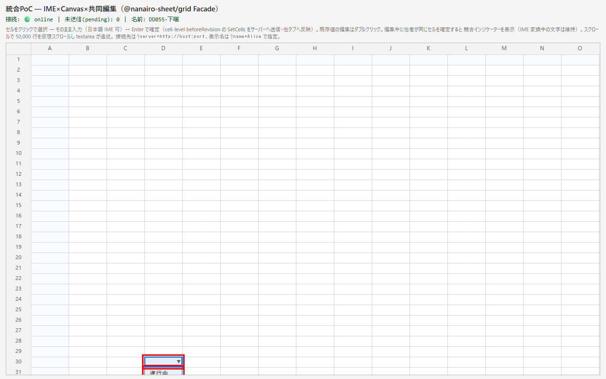
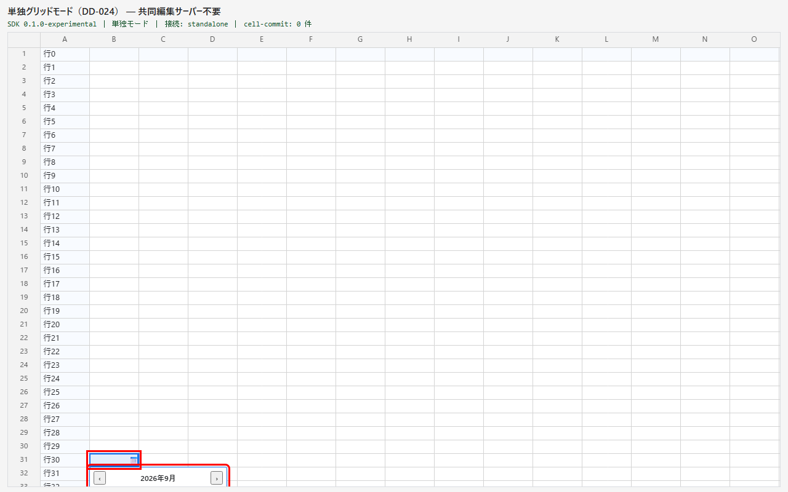
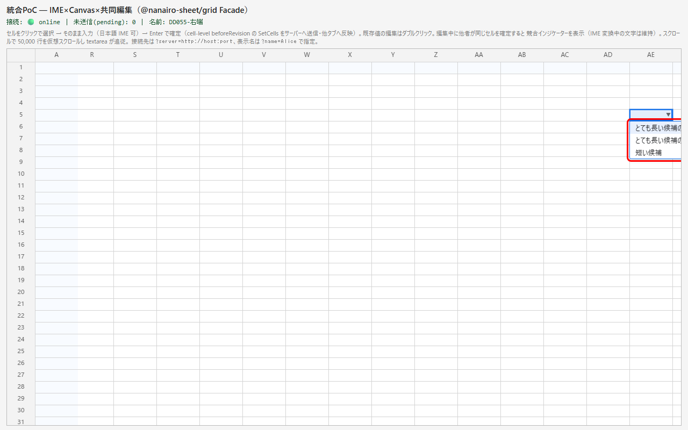
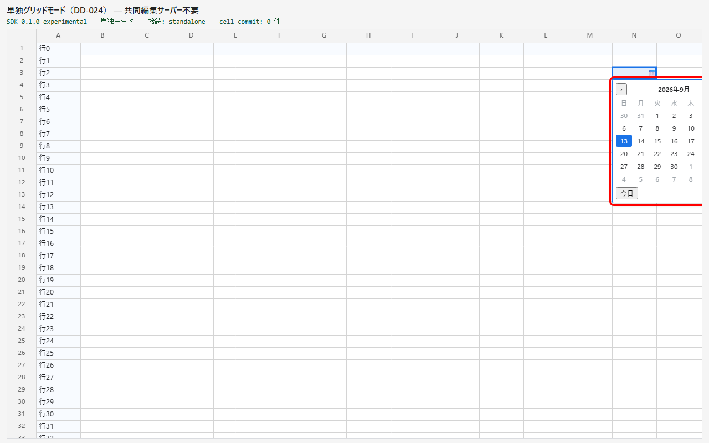
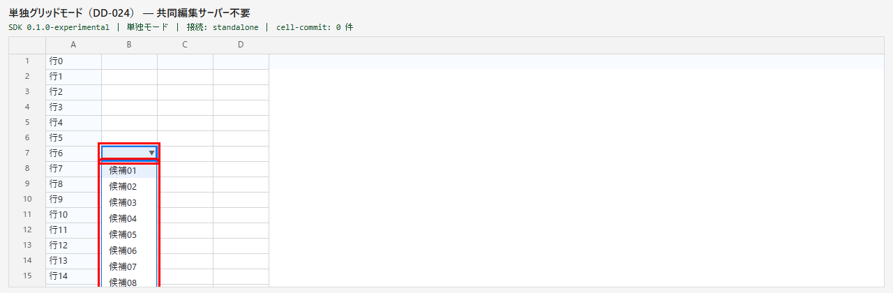
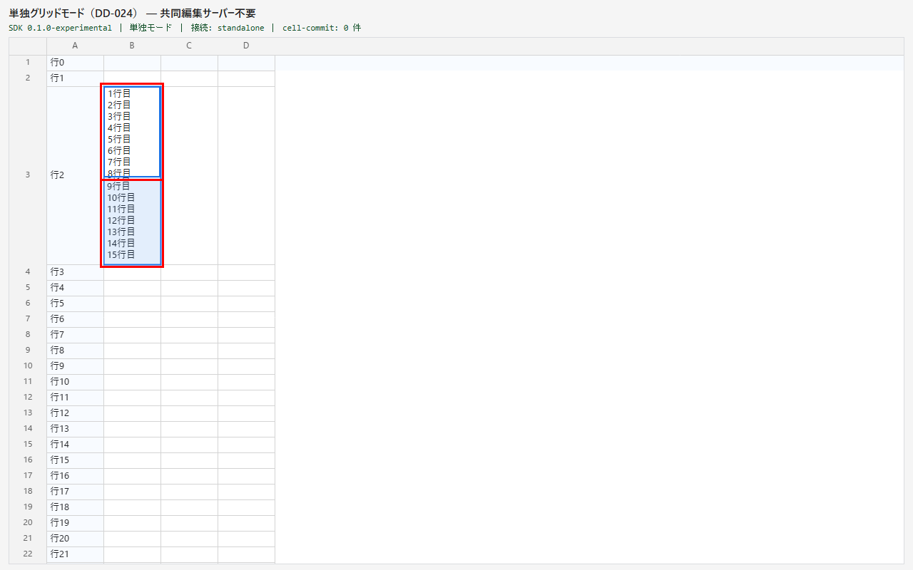
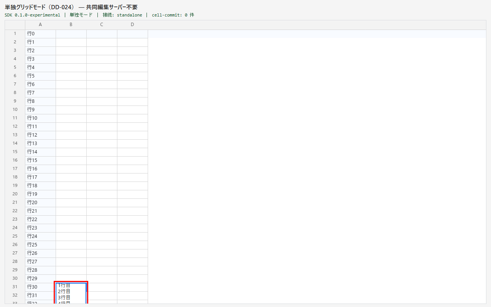
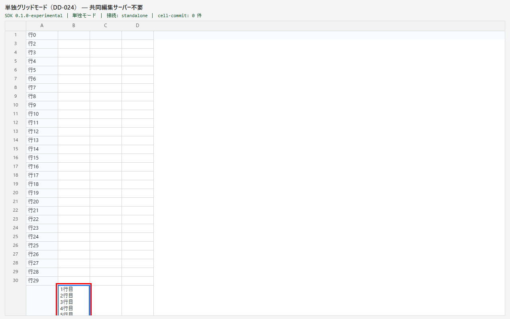

# DD-055 バグ再現レポート

確認日: 2026-09-13
環境: playground（Vite :5199・Chromium headless・viewport 1280×800〔上下とも狭いケースは 1280×420〕）。単独モード `standalone.html`／共同編集モード `poc-integration.html`（WS :8799）。headless Chromium はスクロールバーを隠すため、scroller の右・下に 16px を空けて通常のスクロールバーを模擬した（DD-046 と同じ方法）。

- 数値は stage の左上を原点とする px。可視域＝スクロールバーを除いた scroller の client 寸法
- 再現手順は `apps/playground/e2e` の DD-055 ケースそのもの。修正前のコードで実行し、検証より前に画面と数値を保存した（赤枠＝候補欄・編集欄・対象セル）

---

## Bug#1: 候補欄（選択式のドロップダウン・日付のカレンダー）が可視域の外へはみ出して切れる

**現象**: 可視域の下端近くのセルで開くと候補欄が常にセルの下に開き、横スクロールバーの位置と枠の下で切れて候補を選べない。右端近くの列で開くと右へはみ出して切れる。

| 下端（選択式・共同編集モード） | 下端（日付・単独モード） |
|---|---|
|  |  |

| 右端（選択式） | 右端（日付） | 上下とも狭い（選択式・30 候補） |
|---|---|---|
|  |  |  |

| ケース | セル x, y, 幅×高さ | 候補欄 x, y, 幅×高さ | 候補欄の端 | 可視域（stage） | はみ出し |
|---|---|---|---|---|---|
| 選択式・最下行（行 29・列 3） | 292, 662, 80×22 | 292, 684, 80×71 | 下端 755 | 1238×684（1254×700） | 下へ 71px |
| 日付・最下行（行 30・列 1） | 132, 684, 80×22 | 132, 706, 224×224 | 下端 930 | 1238×722（1254×738） | 下へ 208px |
| 選択式・右端の列（行 4・列 30） | 1158, 112, 80×22 | 1158, 134, 170.5×71 | 右端 1328.5 | 1238×684 | 右へ 90.5px |
| 日付・右端の列（行 2・列 13） | 1092, 68, 80×22 | 1092, 90, 224×224 | 右端 1316 | 1238×722 | 右へ 78px |
| 選択式・上下とも狭い（行 6・上の余白 156／下 164） | 132, 156, 80×22 | 132, 178, 80×220 | 下端 398 | 1238×342（1254×358） | 下へ 56px |

- 開いたままスクロール・絞り込み（DD-055 AC5）: 最下行で開いた直後、候補欄の下端とセルの上端のずれは 93px（セルの下に開くため）

## Bug#2: 長文の編集欄がセルより低くなる・可視域の下端を越える

**現象**: 行の高さが 128px を超える wrap 列のセルを編集すると、編集欄が上部 128px で止まり、その下にシートの描画が見える。可視域の下端近くで長文を入力すると、伸びた編集欄が枠の下で切れる。

| 高い行（250px）の編集 | 最下行の 1 行のセルで長文を入力 | 高い行が下端にかかる |
|---|---|---|
|  |  |  |

| ケース | セル y, 高さ | 編集欄 y, 高さ | 編集欄の下端 | 可視域の高さ | 問題 |
|---|---|---|---|---|---|
| 高い行（行 2・15 行の値） | 68, 250 | 68, 128 | 196（セルの下端 318） | 738 | セルの下 122px を覆わない |
| 最下行の 1 行のセルで 6 行入力（行 30） | 684, 22 | 684, 96 | 780 | 722 | 下へ 58px はみ出す |
| 高い行を編集したまま下端にかかるまでスクロール（行 30） | 662, 250 | 662, 128 | 790 | 722 | 下へ 68px はみ出す |

- 1 行の高さのセルで 10 行入力（DD-055 AC7）: 編集欄 128px・内部スクロール（DD-052-1 の仕様どおり。回帰確認用で修正前も Green）

---

## 確認結果サマリー

| Bug# | 概要 | 再現 | エビデンス手段 | 備考 |
|---|---|---|---|---|
| 1 | 候補欄が可視域の下端・右端で切れる | OK（5 ケース） | キャプチャ＋矩形の数値 | 修正前の E2E（DD-055 AC1・AC3・AC4・AC5・日付 AC2・AC4）は全件 Red |
| 2 | 長文の編集欄がセルより低い・可視域の下端を越える | OK（3 ケース） | キャプチャ＋矩形の数値 | 修正前の E2E（AC6・AC8×2）は Red、AC7 は Green |
