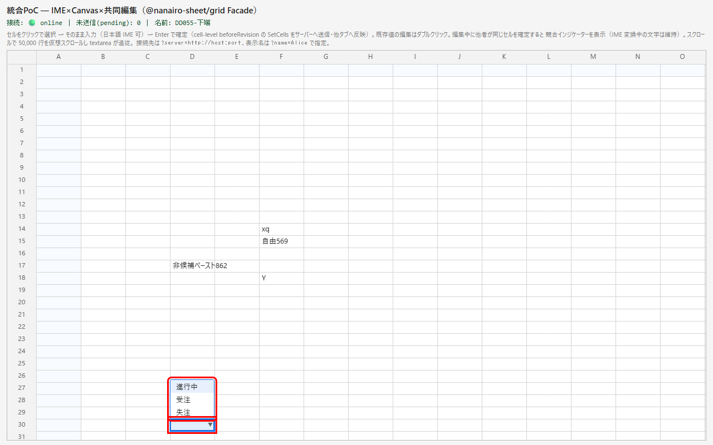
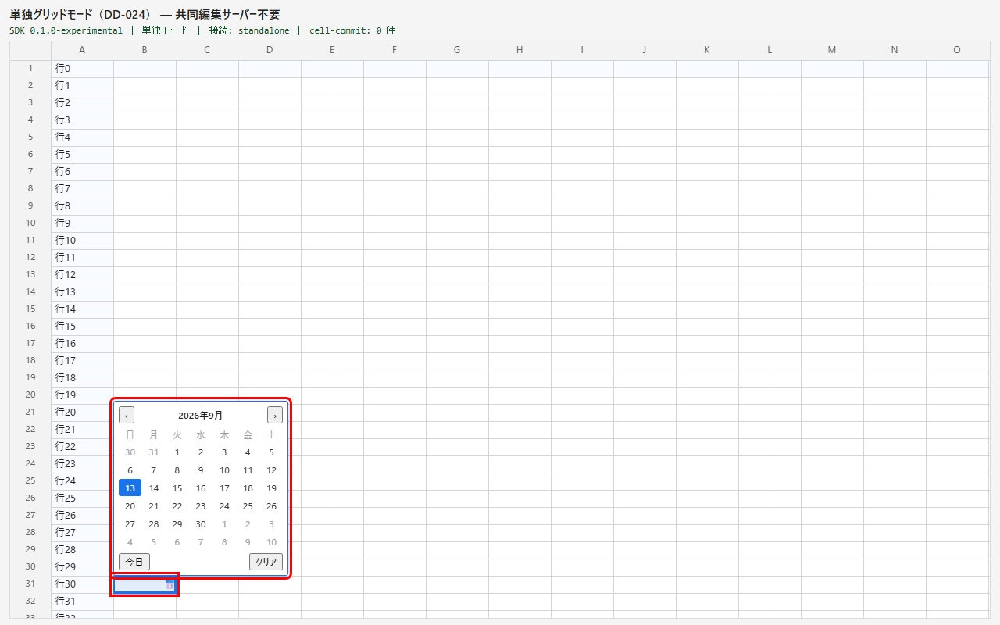
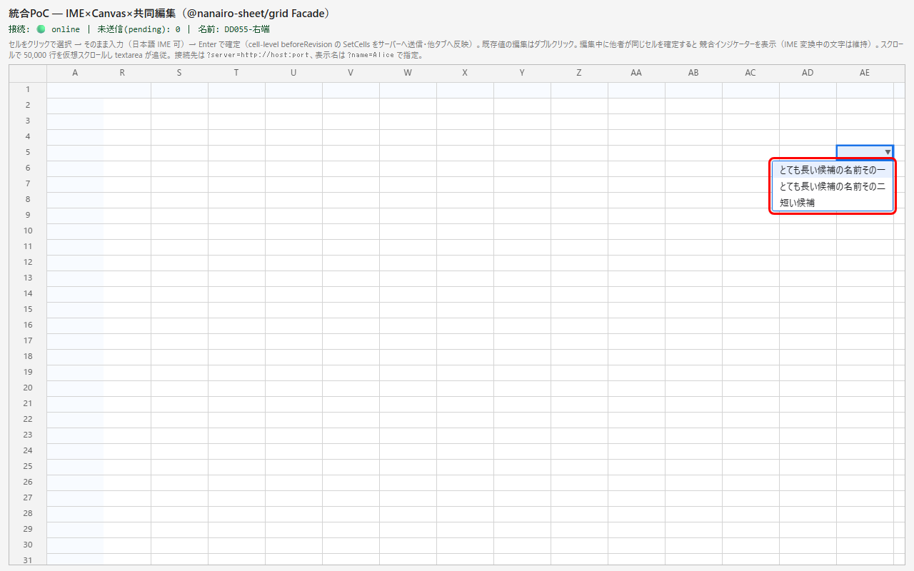
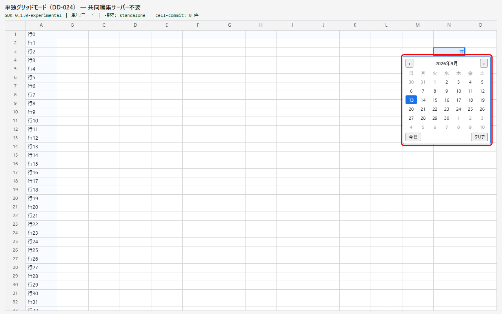
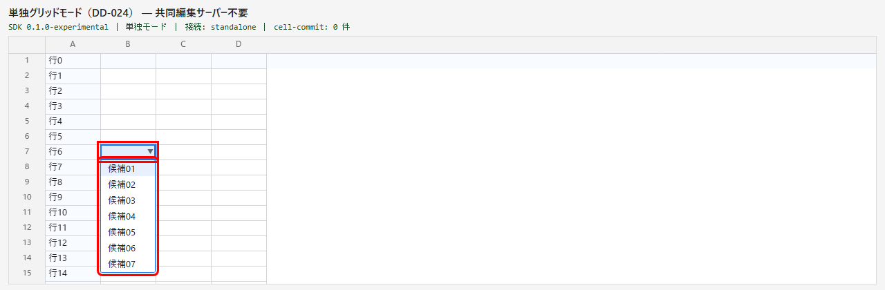
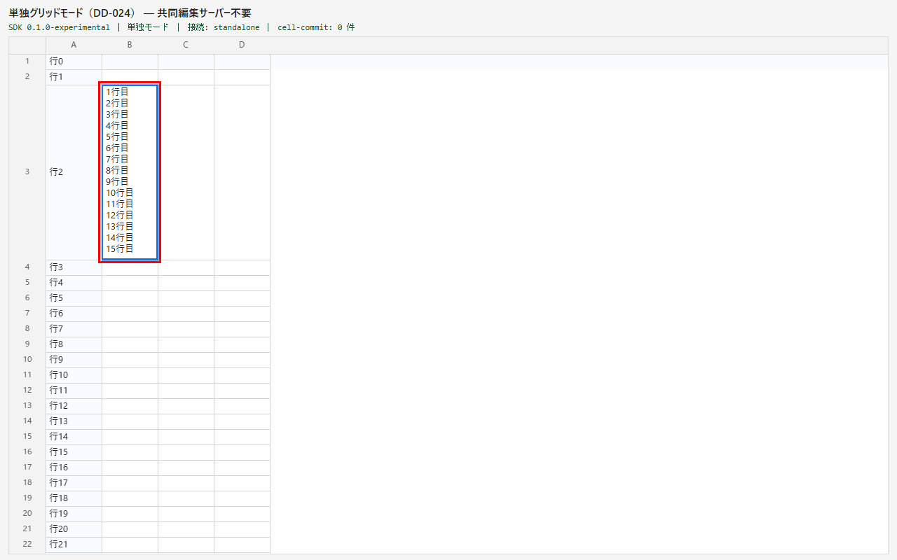
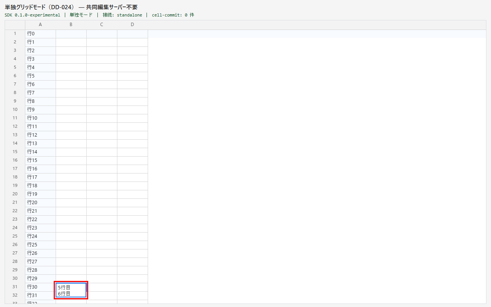
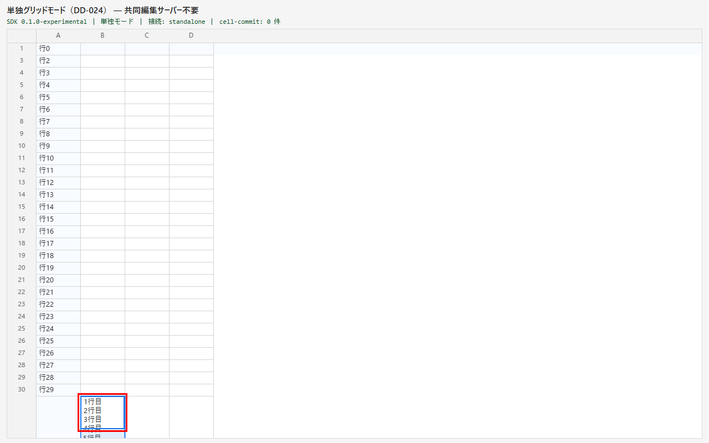

# DD-055 修正検証レポート

確認日: 2026-09-13
環境: bug-report.md と同じ（playground・Chromium headless・スクロールバー相当 16px を模擬）。同じ E2E ケースを修正後のコードで実行し、同じ手順で画面と数値を保存した。数値は stage の左上を原点とする px。

---

## Bug#1: 候補欄が可視域の外へはみ出して切れる

| Before | After |
|--------|-------|
|  |  |
| ❌ 最下行の選択式セル: 候補欄がセルの下に開き、2 件目以降が枠の下で切れる | ✅ セルの上に開き、候補欄の下端がセルの上端に揃う |
|  |  |
| ❌ 最下行の日付セル: カレンダーの大半が枠の下で切れる | ✅ セルの上に開き、全体が可視域に入る |
|  |  |
| ❌ 右端の列: 候補欄が右へはみ出す | ✅ 右端を可視域の右端に揃えて左へずれる |
|  |  |
| ❌ 右端の列: カレンダーが右へはみ出す | ✅ 左へずれて収まる |
|  |  |
| ❌ 上下とも狭い（30 候補）: 候補欄（220px）が下へはみ出す | ✅ 広い側（下 164px）に開き、164px に縮めて内部スクロール |

| ケース | 項目 | 修正前 | 修正後 | 期待値 | 判定 |
|------|------|--------|--------|--------|------|
| 選択式・最下行（セル y 662） | 候補欄 y・高さ／下端 | 684・71／755 | 591・71／662 | 下端＝セルの上端（662）≤ 可視域 684 | OK |
| 日付・最下行（セル y 684） | カレンダー y・高さ／下端 | 706・224／930 | 460・224／684 | 下端＝セルの上端（684）≤ 可視域 722 | OK |
| 選択式・右端の列（セル x 1158） | 候補欄 x／右端 | 1158／1328.5 | 1068／1238.5 | 右端 ≤ 可視域の右端 1238（1px 未満の端数は許容） | OK |
| 日付・右端の列（セル x 1092） | カレンダー x／右端 | 1092／1316 | 1014／1238 | 右端 ≤ 1238 | OK |
| 選択式・上下とも狭い（上 156／下 164） | 候補欄 y・高さ／下端・内部スクロール | 178・220／398・あり | 178・164／342・あり | 広い側（下）に開き下端 ≤ 可視域 342 | OK |

- 開き方: 選択式は F2・Enter・Alt+↓・ダブルクリック・厳格モードの文字キーの 5 通り、日付は F2・Alt+↓・ダブルクリック・📅 の 4 通りすべてで同じ結果（E2E `DD-055 AC1`・日付 `DD-055 AC2`）。下に余白のあるセルは従来どおり下に開く
- 開いたままスクロール・絞り込み: 最下行で上に開いた候補欄は、5 行・12 行スクロールしても下端＝セルの上端（ずれ 0px。修正前は開いた直後から 93px）。セルが画面外へ出たら閉じる。自由入力併存列で候補が 3 件→1 件に絞られても下端はセルの上端のまま（E2E `DD-055 AC5`）。日付も開いたまま 5 行スクロールして上向きのまま追従（日付 `DD-055 AC2`）
- 上下とも狭いとき: ↓ で最後（30 件目）まで送った候補が候補欄の表示範囲に入る（`DD-055 AC3`）。カレンダーも ↓ 4 回で 6 週目の行へ動かしたハイライトの日が表示範囲に入る（日付 `DD-055 AC3`）

**修正内容**: 候補欄の配置を純関数 `computePopupPlacement`（`packages/grid/src/popup-placement.ts`）に切り出し、`select-editor.ts`・`date-editor.ts` の配置から使う。向きは開いた時点で決めて閉じるまで保持し、可視域は mount-controller の `visibleArea()`（スクロールバーを除く・DD-046 のセル追従と同じ基準）から読む。

---

## Bug#2: 長文の編集欄がセルより低くなる・可視域の下端を越える

| Before | After |
|--------|-------|
|  |  |
| ❌ 高い行（250px）: 編集欄が 128px で止まり、9 行目以降はシートの描画が見える | ✅ 編集欄がセル全体（250px）を覆う |
|  |  |
| ❌ 最下行の 1 行のセルで 6 行入力: 編集欄が枠の下へはみ出す | ✅ 可視域の下端までに縮めて内部スクロール |
|  |  |
| ❌ 高い行が下端にかかる: 128px で切り詰めたうえ枠の下へはみ出す | ✅ 可視域の下端までに縮めて内部スクロール |

| ケース | 項目 | 修正前 | 修正後 | 期待値 | 判定 |
|------|------|--------|--------|--------|------|
| 高い行（セル y 68・高さ 250） | 編集欄の高さ／下端 | 128／196 | 250／318 | セルの下端 318 | OK |
| 最下行の 1 行のセル（y 684）で 6 行入力 | 編集欄の高さ／下端・内部スクロール | 96／780・なし | 38／722・あり | 下端 ≤ 可視域 722・1 行分（20px）以上 | OK |
| 高い行が下端にかかる（セル y 662・高さ 250） | 編集欄の高さ／下端・内部スクロール | 128／790・あり | 60／722・あり | 下端 ≤ 可視域 722 | OK |

- 高い行で中身をセルより長くする（21 行）: 高さはセルの 250px のまま内部スクロール（E2E `DD-055 AC6`）
- 1 行の高さのセルで 10 行入力: 従来どおり 128px・内部スクロール（`DD-055 AC7`。DD-052-1 AC4 の回帰なし）
- 縮めた編集欄の中を末尾までスクロールしてからグリッドを 1px 動かして再配置しても、内部スクロール位置は末尾のまま（`DD-055 AC8` の 2 件目）。中身の高さを「セルの高さへ戻して」測る旧方式に一時的に戻すとこの確認が失敗することを確かめた（セルより低く縮めている間、測るたびに内部スクロール位置が先頭側へ切り詰められる）

**修正内容**: 編集欄の高さを純関数 `computeWrapEditorHeight`（`packages/grid/src/editor-placement.ts`）に切り出し、上限を `max(セルの高さ, 128px)` にして、可視域の下端を越える分は縮める（1 行分は残す）。`integration-editor.ts` の `applyHeight()` は中身の高さを高さ 0 にしてから測る。

---

## 確認結果サマリー

| Bug# | 概要 | Before | After | エビデンス手段 | 判定 |
|------|------|--------|-------|--------------|------|
| 1 | 候補欄が可視域の下端・右端で切れる | 下へ最大 208px・右へ最大 90.5px はみ出す | すべて可視域の中（上に開く・左へずらす・余白に縮める） | キャプチャ＋矩形の数値＋E2E | PASS |
| 2 | 長文の編集欄がセルより低い・可視域の下端を越える | セルの下 122px を覆わない・下へ最大 68px はみ出す | セル全体を覆う・可視域の下端までに縮める | キャプチャ＋矩形の数値＋E2E | PASS |
