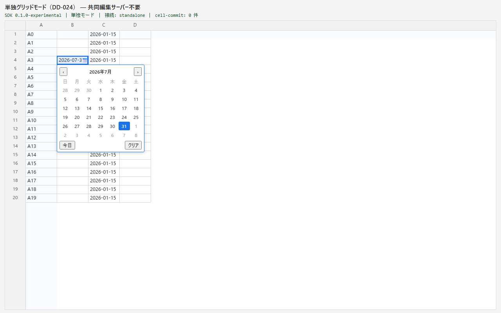
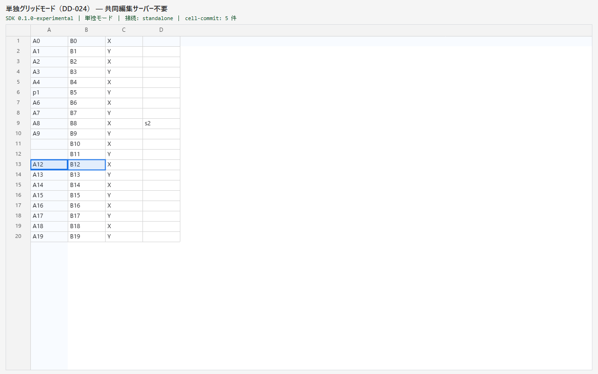
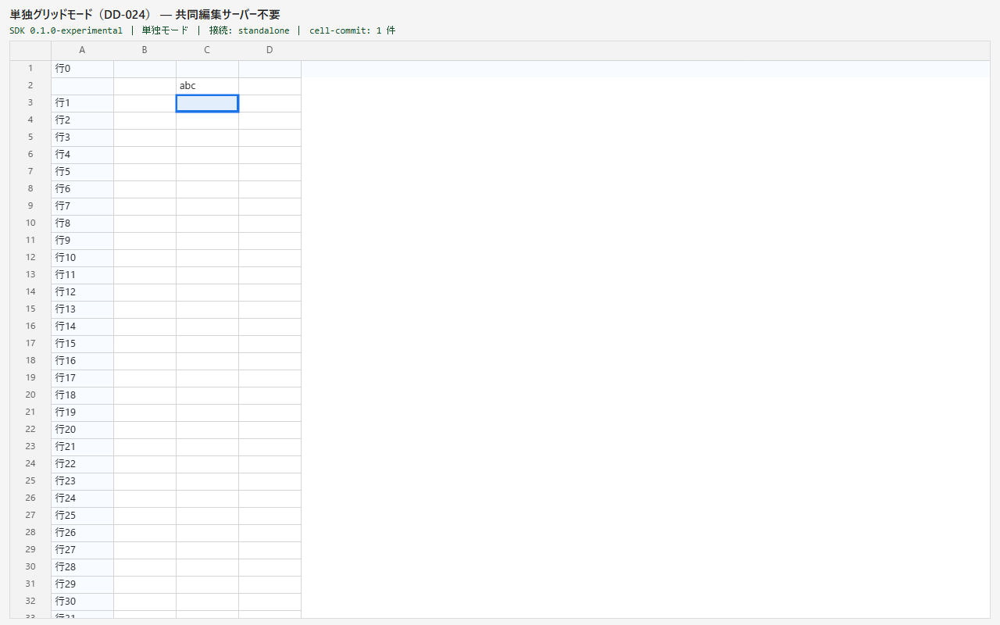

# DD-035: 列タイプ拡張と命令API（consumer 駆動: 松下 生産納期）

| 作成日 | 更新日 | ステータス | 補足 |
|--------|--------|-----------|------|
| 2026-09-03 | 2026-09-03 | 完了 | 日付列（カレンダー）・readOnlyColumns・scrollToRow/setActiveCell・React handle 4 メソッド＋列スキーマ props 6 点を提供。AC1〜9 充足・Codex high P1×1/P2×3 全反映・全回帰 green（unit 1155・E2E 123＋3）。T1/M1 未実施＝既知の未保証境界へ移送。ユーザー確認済みでアーカイブ（2026-09-03） |

> アプローチ: 標準＋TDD（純関数: カレンダー制御・キー裁定・readOnly 列フィルタ）＋E2E駆動（配線: Playwright ハーネス）。要件は consumer 実案件で実測済み（guides.md §1）

```text
Risk Class: A（公開 API 新設〔date 列タイプ・readOnlyColumns・GridInstance 2 メソッド・React handle 4 メソッド＋列スキーマ props 6 点〕・R2/R4 が editor 経路に接する）
Risk Triggers: 公開 API/Options の新設／R2 カレンダーが編集開始・確定経路に接する（editor-state-machine・ime-editing-session は無改変＝📐で確定。常駐 textarea（integration-editor）は R4 の列単位ロックで**分岐追加**＝DD-033-1 と同型ゆえ T1 該当）／R4 が DD-033-1 の抑止 2 層（入口＋chokepoint）を列単位条件へ拡張
Human Spec Gate: required → **推奨案で代行確定（2026-09-03・ユーザー進行指示「一通り終わったら Codex レビュー」に基づく。DD-026 前例=[[dd-phase-autonomy]] 追記）**。確定内容は検討内容の表＋添付 contract.md。異論があれば決定事項を差し戻す
Codex: high（実装完了後にユーザー指示で CLI 実行・findings は妥当性判断のうえ Claude が反映）
Manual Gate: あり・クローズ非ブロック（T1=実IME 台帳 5 点＋列 readOnly セルで IME 起動不可／M1=カレンダー実機操作感）。未実施なら「既知の未保証境界」へ移送
External Review: なし
Evidence Level: full（A 区分。E2E スクショ証跡・既知の未保証境界を省略しない）
```

## 目的

consumer 統合①（松下 生産納期 = DD-026）の実案件が、共同編集化（松下 DD-012-2）を完了した時点で持ち越した SDK 側の 4 要件を提供する:

- **R2 日付カレンダー入力**: 日付列でカレンダーのポップオーバーから選べる（手入力と併存）
- **R4 列単位 readOnly**: 指定列の編集開始を拒否し、範囲貼り付けはその列をスキップ
- **R6 スクロール・アクティブセルの命令 API**: `scrollToRow(rowId)` / `setActiveCell(rowId, columnId)`
- **R7 行操作の命令 API**: react handle から `insertRows` / `deleteRows` を発行できる（ボタン起点の行追加用）

## 背景・課題

- DD-026（U1〜U3）・DD-027（選択式・リンク・書式）・DD-033（readOnly・キャプション・表示書式）で松下要件の大半は成立し、松下側 DD-012-2 は共同編集を実機で通した（2 ブラウザ収束・JWT 認証・Postgres 投影。2026-09-03）。その適合・E2E 作業で残った SDK 側ギャップが本 4 件
- 要件の詳細・優先度・consumer 側で確認することは**松下リポ `doc/DD/DD-012/sdk-requirements.md` §B が正本**（R2=高 / R4・R6=中 / R7=低）。乖離したらメモ側が勝つ
- 現状の実測（2026-09-03）:

| # | 要件 | 現状 | 欲しい形（メモの要旨） |
|---|------|------|----------------------|
| R2 | 日付カレンダー | 手入力 → LocalDate 正準化（ADR-0012）は成立済み。カレンダー UI は無い | 日付列指定でポップオーバーから選択、確定値は LocalDate 正準値。手入力併存。開き方は利用側で指定 |
| R4 | 列単位 readOnly | `readOnly` はグリッド全体のみ（DD-033-1）。consumer は算出列への入力をサーバー側投影の無視で防御（文書には残る＝画面上ずれる） | 列単位フラグ。編集開始を拒否し、範囲貼り付けはその列をスキップ。サーバー側拒否は将来スコープ |
| R6 | scrollToRow / setActiveCell | 無い。`setData` 再注入後もスクロール位置が保たれ、先頭に入った追加行が画面外のまま（松下 DD-012-1 実測） | 両モードで機能する命令 API |
| R7 | 行操作の命令 API | `GridInstance` には `insertRows`/`deleteRows` がある（DD-021-1）が React handle は setData/focus/connectionState のみ | handle への追加。共同編集モードでは通常の submit 経路に乗る |

- **起票後の実調査で判明した前提ギャップ**: React Facade（`packages/react/src/index.ts`）は DD-027/033 の列スキーマ系オプション（columnTypes/columnFormats/columnCaptions/columnDisplayFormats/readOnly）を**一切写像していない**。松下は `<NanairoSheetView mode="collaboration">` を使うため、R2/R4 は React props の写像を足さないと consumer から到達不能 → 本DDのスコープに含める（薄い写像・contract.md §5）
- 対象外: R1 選択式（DD-027-1 提供済み）/ R3 表示書式（DD-033-2 提供済み）/ R5 アクティブセルイベント（不要判定）/ U6 poison 観測口（consumer 側の自主検知で代替）/ 共同編集サーバー側の列権限

## 検討内容（Human Spec Gate・推奨案で代行確定）

| # | 論点 | 選択肢 | 確定（推奨案）と理由 |
|---|------|-------|-------------------|
| 1 | R2 の API 面 | (a) `columnTypes` に `{ type:'date' }` / (b) 専用オプション | **(a)**。select/link と同じ宣言面・同じ fail-fast 経路・React 写像も 1 props で済む。カレンダーは listbox（DD-027-1）と同方式の別 DOM＋既存 chokepoint 確定＝IME 不変条件に触れない（📐: editor-state-machine/ime-editing-session 無改変を実読で確認） |
| 2 | R2 の開き方 | ダブルクリック / F2 / セル右端アイコン | **`openOn: 'dblclick'`（既定）／`'icon'`** の 2 値。既定は select と同じキー体系（dblclick/F2/Enter/Alt+↓/アイコン）で発見性を優先し、印字文字は常に手入力＝併存。`'icon'` は既存値の部分修正が多い列向け。3 値以上の組合せ指定は要求が出るまで作らない |
| 3 | R4 の API 面 | (a) `columnTypes` に readOnly 種 / (b) `readOnlyColumns: string[]` | **(b)**。readOnly は「型」でなく select/date 等の型と**直交**する属性（読み取り専用の選択式列が要る）。wrapColumns と同運用・registry で未知列/重複を fail-fast。DD-033-1 の 2 層抑止を「アクティブセルの列」条件へ拡張 |
| 4 | R4 の貼り付け挙動 | スキップ vs 全体拒否 | **スキップして他列へ適用**（メモの要求）。TSV の列位置はずらさない・全セルがスキップなら no-op・診断 info に件数。上限/はみ出し検査は矩形全体で従来どおり（先に判定）。範囲クリア・cut も同じフィルタ |
| 5 | R6/R7 の公開面 | grid / react のどこまで | **grid `GridInstance` に R6 2 メソッド新設、React handle は R6+R7 の 4 メソッドを直結写像**。加えて列スキーマ props 6 点を React へ写像（背景の前提ギャップ）。R6 は構造 dirty 中の要求を**保留→flush 後適用**（`setData` 直後の呼び出しを成立させる） |
| 6 | 子DD分割 | 分割 / 単一 | **単一DD・5 Phase**。レビューゲートは完了後の Codex 1 回のみ（guides §6「1 レビューサイクル＝1 DD」・DD-034 親統合レビュー 1 回）。子分割は本文 3 本＋台帳の運用コストが利益を上回る |

## 決定事項

- 論点 1〜6 は上表の確定欄のとおり。公開面の詳細契約（型・操作・診断コード・React 写像）は **`DD-035/contract.md` を正本**とする（本文へ再転記しない）
- 実装順は依存の薄い順: Phase 2 R6/R7＋React 写像 → Phase 3 R4 → Phase 4 R2 → Phase 5 統合（R2 は R4 の列ロックを参照するため後）
- 無改変制約: `packages/ime/*`・`packages/grid/src/ime-editing-session.ts`・`editor-state-machine` は無改変。`integration-editor.ts` は列ロック用の分岐追加のみ（readOnly=false かつ列ロック無しの経路は完全無変更）＝改変が必要と判明したら停止して報告
- 公開 error/conflict code は追加しない（不正設定は既存 `column-types-invalid`・抑止は診断のみ＝DD-033-1 と同方針）

## 受け入れ基準

| # | 基準（操作 → 期待結果） | 検証方法 |
|---|------------------------|---------|
| 1 | 日付列（openOn 既定）で dblclick/F2/Alt+↓/アイコン → カレンダーが開き、日クリック or Enter で `YYYY-MM-DD` が committed に反映（cell-commit 発火・Undo で戻る）。Esc/外クリックは文書無変更・focus は textarea のまま | Phase 4 E2E `date-column.spec.ts`＋unit `date-editor.test.ts` |
| 2 | 日付列で印字文字キー → 従来どおり textarea 手入力が開き `2026/7/31` が `2026-07-31` に正準化される。`openOn:'icon'` の列は dblclick/F2 で textarea 編集 | Phase 4 E2E |
| 3 | `readOnlyColumns` 指定列で 印字キー・F2・dblclick・synthetic IME・Delete/Backspace のいずれでも編集 UI が開かず文書無変更（診断 `readonly-column-blocked`）。他列は従来どおり編集できる | Phase 3 E2E `readonly-columns.spec.ts`＋unit |
| 4 | readOnly 列を含む矩形へ貼り付け／Delete 範囲クリア → readOnly 列のセルはスキップされ他列だけ適用（TSV 列位置不変・診断 `readonly-column-skipped`）。全セル readOnly なら no-op | Phase 3 E2E＋unit `readonly-policy.test.ts` |
| 5 | readOnly 列でも範囲選択・コピー・スクロール・行挿入削除・setData・（共同編集）リモート受信反映が従来どおり動く | Phase 3 E2E |
| 6 | `scrollToRow(rowId)` → 画面外の行が可視化される（`setData` 再注入直後・行挿入直後の新 RowId でも成立）。`setActiveCell(rowId, columnId)` → activeCell がそのセルへ移り可視化・focus。未知 ID は診断 warn のみ | Phase 2 E2E `imperative-nav.spec.ts` |
| 7 | React handle の `insertRows`/`deleteRows`/`scrollToRow`/`setActiveCell` が GridInstance へ直結し、未 mount 時は `handle-before-mount` warn。列スキーマ props（columnTypes 等 6 点）が mount オプションへ写像され、変更で remount する | Phase 2 unit `nanairo-sheet-view.test.ts`＋E2E `react-facade.spec.ts` |
| 8 | 4 オプション/メソッドいずれも未使用の既存 consumer は現行挙動と完全一致（既存 unit・invariants・E2E 全スイートが無修正 green） | Phase 5 全回帰 |
| 9 | 公開 .d.ts snapshot の差分が追加のみ・CHANGELOG 記載・`features.json` 更新・boundary lint new=0 | Phase 5 contract test＋features smoke＋lint |

## タスク一覧

### Phase 1: 仕様確認（Human Spec Gate）
- [x] 検討内容の論点 1〜6 を確定（推奨案で代行・添付 contract.md へ契約固定）。子DD分割なし・実装順確定
- [x] 📐 実装前詳細化: mount-controller（chokepoint・openSelect/confirmSelect・ensureCellVisible・masterLoop の構造 flush・applyStandaloneData）・integration-editor・clipboard-controller・column-types・react index を実読 → editor-state-machine/ime-editing-session 無改変で成立と確定
- [x] 🔬 機械検証: `bash scripts/dd-health.sh --dd DD-035 --new` → ⚠️ なし／`bash scripts/doc-check.sh` → OK（2026-09-03）

### Phase 2: R6/R7 命令 API＋React 写像
- [x] `packages/grid/src/index.ts`: `GridInstance` へ `scrollToRow`/`setActiveCell` 追加（JSDoc=contract §3）
- [x] `packages/grid/src/mount-controller.ts`: 命令の保留キュー（boot 前・初回描画前・構造 dirty 中は次 flush 後に適用・上限 64）＋`scrollToRow`（ensureCellVisible 流用・横不変）＋`setActiveCell`（pointerdownCell 経路・ポップアップ閉じ・レンジ解除）＋debug API `scrollTop()/scrollLeft()`
- [x] `packages/react/src/index.ts`: handle 4 メソッド＋列スキーマ props 6 点（識別系・mountKey 値直列化）／`nanairo-sheet-view.dd035.test.ts`（新規 5 件・既存 test 無修正）
- [x] `apps/playground/src/integration/react-main.ts`: handle の E2E ブリッジ／`apps/playground/e2e/imperative-nav.spec.ts`（新規 3 件）＋`react-facade-handle.spec.ts`（新規 2 件）
- [x] 🔬 機械検証: `npx vitest run packages/react packages/grid` → green（368）／`npx playwright test imperative-nav react-facade-handle` → green（5 件・imperative-nav は `--repeat-each 3` で 9/9）

### Phase 3: R4 列単位 readOnly
- [x] `packages/grid/src/column-types.ts`: `createColumnTypeRegistry(..., readOnlyColumns)`＋`isReadOnlyColumn`/`hasAnyReadOnlyColumn`（未知列・重複 fail-fast）／`readonly-columns.test.ts`（新規・registry＋フィルタ 8 件）
- [x] `packages/grid/src/readonly-policy.ts`: `partitionReadOnlyColumnChanges`／`touchesReadOnlyColumn` 純関数（貼り付け・範囲クリア・cut・chokepoint で共有）
- [x] `packages/grid/src/integration-editor.ts`: `isInputLocked?: () => boolean`（dispatch 抑止を readOnly と同分岐で共有）＋`setInputLock(locked)`（非 composing 時のみ textarea.readOnly 属性を同期・同値無操作）。readOnly=false かつ未ロック経路は無変更
- [x] `packages/grid/src/mount-controller.ts`: 入口（interceptKeydown・dblclick・openSelect・貼り付け/範囲クリア/cut のフィルタ・onChange で列ロック同期・▼ インジケーター非表示・readOnly 選択式セルは非選択式として裁定）＋chokepoint（submitSetCells/submitToBackend で op 破棄）
- [x] `packages/grid/src/index.ts`: `readOnlyColumns` オプション（JSDoc=contract §2）／playground 両フィクスチャ `?readonlycols=`／`apps/playground/e2e/readonly-columns.spec.ts`（新規 3 件）
- [x] 🔬 機械検証: `npx vitest run packages/grid` → green／`npx playwright test readonly-columns readonly clipboard-standalone` → green（12 件・既存 readonly 6 件無修正）

### Phase 4: R2 日付カレンダー
- [x] `packages/grid/src/date-editor.ts`（新規）: 純関数（LocalDate 加減算・月グリッド生成・`createCalendarController`・`decideDateKey`）＋薄い DOM アダプタ（ポップオーバー・📅 インジケーター・rAF 追従）／`date-editor.test.ts`（新規 13 件）
- [x] `packages/grid/src/column-types.ts`: `GridDateColumnType`（`openOn` 検証）＋registry `isDateColumn`/`getDateType`/`hasAnyDateColumn`／`index.ts` 型 export・JSDoc（contract §1）
- [x] `packages/grid/src/mount-controller.ts`: openDate/cancelDate/confirmDate（confirmSelect と同型・`submitSetCells`）・dblclick/interceptKeydown 分岐・refresh（composition/対象消失/画面外で閉じる）・debug API `dateOpen()/dateHighlightedValue()/dateViewMonth()`
- [x] playground 両フィクスチャ `?date=col-b,col-c!icon`／`apps/playground/e2e/date-column.spec.ts`（新規 3 件）
- [x] 🔬 機械検証: `npx vitest run packages/grid` → green（370）／`npx playwright test date-column column-types-select` → green（14 件・既存 select 11 件無修正）

### Phase 5: 統合・提供開始
- [x] `tests/contract` snapshot 更新（`npx vitest run tests/contract -u`・差分は union/引数/JSDoc の拡張のみ＝削除なしを目視）／`CHANGELOG.md` Added 4 項目／`doc/archived/DD/DD-017/error-codes.md` は追加なし（診断 code のみ・contract §6）
- [x] `apps/showcase/src/features.json`: `column-types`（日付列・読み取り専用列）・`row-ops`・`react`（handle 命令 API・列スキーマ props）の summary/meta/source 更新 → features smoke green（6 件）
- [x] 📸 エビデンス: E2E スクショ 6 点を `DD-035/` へ（下表）
- [x] 😈 セルフレビュー 1 巡（所見はログへ）
- [x] 🔬 機械検証（全回帰 1 回）: `npm test`（111 files/1155 tests）／`npm run typecheck`／`npm run lint`（boundary new=0）／`npm run test:e2e`（123 passed・3.9 分）／`npm run test:e2e:showcase`（3 passed）→ 全 green（AC8・2026-09-03。Codex 反映後に unit/typecheck/lint/E2E を再実行し green）
- [ ] tarball 再生成は松下側 DD が実施（`scripts/release/build-release.sh`・引き渡し手順は松下メモ「持ち込み後の作業」）

### 完了前チェック
- [x] 受け入れ基準 1〜9 を照合 → 全充足（1/2=date-column.spec 3 件＋unit 13・3/4/5=readonly-columns.spec 3 件＋unit 8・6=imperative-nav.spec 3 件・7=react unit 6＋react-facade-handle.spec 2 件・8=全回帰 green・9=snapshot 拡張のみ/CHANGELOG/features smoke/boundary new=0）
- [x] Manual Gate 未実施分（T1/M1）を「既知の未保証境界」へ移送
- [x] Codex レビュー（ユーザー指示）→ findings 4 件の採否をログへ（全採用・反映後に unit/typecheck/lint/E2E 再実行）

## エビデンス（E2E 自動キャプチャ・After のみ）

|  |  |  |
|---|---|---|
| R2: B 列（日付列）で F2 → カレンダー（現値 2026-07-31 をハイライト） | R4: B/C 列 readOnly。貼り付け・範囲クリア・cut が A/D 列だけに適用（B/C 不変） | R6: 末尾へスクロール後 insertRows＋setActiveCell → 新行が可視化・アクティブ |

他: `e2e-imperative-1-scroll-to-row.png`（setData 直後の scrollToRow）・`e2e-react-handle-1-insert-active.png`（React handle）・`e2e-readonly-columns-1-blocked.png`（readOnly 列の編集抑止）。

## 既知の未保証境界・既知制約

- **T1/M1 未実施（Manual Gate・クローズ非ブロック）**: 列単位 readOnly の実 IME 物理遮断（textarea.readOnly 属性の動的切替下で MS-IME が起動しない／隣列で起動する）と、カレンダー表示中に実 IME を起動した場合の閉じ挙動（毎フレーム防御で閉じる設計）は synthetic composition でのみ検証。問題が出た場合の影響: readOnly 列で変換ウィンドウが見える（文書は chokepoint で不変）／カレンダーと変換ウィンドウが同時に見える（確定は片方のみ）。
- **readOnlyColumns は権限制御ではない**（サーバー側強制なし・DD-033-1 readOnly と同型）。共同編集の列権限（サーバー側拒否）は本DD対象外（要件メモ R4 のとおり将来スコープ）。
- **日付列は入力規則ではない**: 非日付文字列の手入力・paste・setData は拒否せず string として保持する（link 列と同じ）。厳格化（`strict`）は要求が出たら拡張点。
- **日付列と `columnDisplayFormats`（date pattern）は別オプション**: カレンダーは raw（`YYYY-MM-DD`）で確定し表示整形は書式側の責務（契約不変＝DD-033-2）。
- **「今日」はブラウザのローカル日付**（利用者の体感日）。サーバー時刻・タイムゾーン指定は非対応。
- **scrollToRow は最小スクロール**（可視なら動かさない）。「先頭に揃える／中央に出す」の align 指定は要求が出たら拡張点。frozen 行（index 0）は常に可視のため無変更。
- **setActiveCell は常駐 textarea へフォーカスを移す**（クリック同経路）。フォーカスを移したくない用途は `scrollToRow` を使う。
- **命令の保留は 64 件まで**（空文書・boot 失敗のまま呼び続けた場合は最古から破棄・診断 warn）。

## Manual Gate（クローズ非ブロック・正味）

| # | 項目 | 正味 |
|---|------|------|
| T1 | 実IME 台帳 5 点（`ime-manual-gate-ledger.md` §2）＋変更固有: readOnly 列セルで IME を起動できない・隣の可編集列へ移ると起動できる（integration-editor の列ロック分岐） | 5 分 |
| M1 | 日付列カレンダーの実機操作感（マウス選択・キー移動・月送り・外クリック取消・実 IME 手入力との併存） | 3 分 |

## ログ

### 2026-09-03
- 起票。松下リポの DD-012-2（共同編集化）完了作業からの持ち込みで、DD-026 と同じく松下側セッションが起票を代行（以後は spreadjs 側のセッションで進める）
- 要件出所: 松下 `doc/DD/DD-012/sdk-requirements.md` §B の R2/R4/R6/R7（2026-09-03 更新版）。同メモの U1〜U3・R1・R3 は DD-026/027/033 で成立済み、U6 は consumer 側の自主検知で代替のため対象外
- 番号は DD-030〜032 がロードマップ予約（ReadyCrew 統合・配布昇格・Stage 2 判定）のため DD-035 を採番（consumer 駆動の新規トップレベル = DD-033 前例）
- Phase 1（spreadjs 側セッション）: ユーザー指示「DD-035 を開始・一通り終わったら Codex レビュー」に基づき Human Spec Gate を推奨案で代行確定（論点 1〜6・契約は `DD-035/contract.md`）。前提ギャップ（React Facade が列スキーマ props 未写像）を発見しスコープへ追加。子DD分割なし。Codex `--check` → 利用可（codex-cli 0.151.0）。dd-health/doc-check green。ステータス 検討中→進行中
- Phase 2（R6/R7）: 保留キュー方式で `setData`／`insertRows` 直後の命令を成立させた。E2E 初回に「先頭挿入＋setActiveCell 後の印字が旧セルへ確定」が 1 回出たが、同一手順のデバッグ spec 3 連続＋`--repeat-each 3` で再現せず（K3 再ベース→保留命令の順序は診断 `rebase-active-cell`／`set-active-cell` で確認）。spec は frozen 行（index 0 は常に可視）を避け body 行で検証する形へ修正。要因未特定＝既知の未保証境界には載せない（再現条件が無い）が、Codex レビューで保留キューと K3 再ベースの順序を重点確認対象にする
- Phase 3（R4）: integration-editor は DD-033-1 の readOnly 分岐を動的条件（`isInputLocked`）で共有＋`setInputLock`（属性同期）の追加のみ。readOnly=false・未ロック経路は無変更。readOnly 選択式セルで Enter が消費され下移動できない wart をセルフレビューで発見し「非選択式として裁定」へ修正
- Phase 4（R2）: date-editor は select-editor と同構造（純関数＋薄い DOM）。editor-state-machine／ime-editing-session 無改変を確認（grep: 変更ファイルに含まれない）。「今日」はローカル日付（テスト注入可）
- Phase 5: 公開 .d.ts snapshot 更新（拡張のみ）・CHANGELOG・features.json・証跡 6 点。lint（boundary new=0）green
- Codex レビュー（high・`--uncommitted`・ユーザー指示・依頼書=`DD-035/codex-review-request.md`・結果=`codex-review-result.md`）: 総評「要修正」・P1×1/P2×3 → **4 件すべて採用・反映**（見送り 0）
  - P1 保留中 setActiveCell の入力競合（旧セルへ誤確定＝Phase 2 の初回失敗の説明になる）→ 構造 dirty 中の命令は次 rAF を待たず `flushStructural` を**同期実行**して即適用（保留は初回描画前のみ）＋保留中は `isInputLocked` で入力遮断。E2E で「呼び出し直後に activeCell が新行」を同期検証
  - P2 readOnly 列アンカーからの範囲 Delete が抑止され可編集列もクリアされない → 明示レンジありの Delete は readOnly 裁定を通さず範囲クリア（フィルタ）へ流す。E2E ケース追加
  - P2 `Date.UTC` の年 0〜99 写像・9999 超の 5 桁化 → JS Date を使わない暦計算（days_from_civil）＋0001〜9999 外は no-op。unit 追加
  - P2 React mountKey が Record のキー順で remount → 列スキーマ系はキーソート正準化・`readOnlyColumns` は集合としてソート（select 候補順・columnOrder は順序保持）。unit 追加
- Codex 反映後の再回帰: unit（grid+react 391・Codex 追加 unit 含む）・typecheck・lint（boundary new=0）・playground E2E 123 件（Codex P1/P2 の追加ケース含む）・contract snapshot（JSDoc 追従）→ 全 green。ステータス 進行中→完了（アーカイブ＝単一コミットはユーザー確認後）
- 😈 セルフレビュー所見（1 判断 1 行）: ①保留キュー無限成長（空文書で呼び続け）→ 上限 64＋診断で是正 ②readOnly 選択式セルの Enter 消費 → 非選択式裁定へ是正 ③`setActiveCell` の focus 奪取は仕様（契約 §3 に明記・既知制約へ） ④date 列×wrap 列の併用は許可（select と同じ・描画契約に矛盾なし） ⑤React mountKey の列スキーマ直列化コストは列数規模で無視可（initialData とは異なる・コメント明記）
